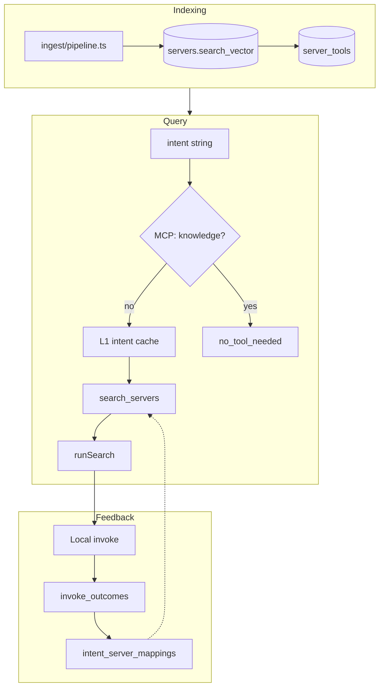

# Relay Search Pipeline

Last updated: 2026-05-22  
Status: Canonical reference for intent search, ranking, measurement, and the discovery→invoke loop

This document describes what Relay **has built** and what is **planned**. For sprint tasks see `SEARCH_IMPLEMENTATION_PLAN.md`. For going live see `LAUNCH_AND_PUBLIC_TESTING.md`.

---

## North star

Collapse three gaps so agents treat MCP tools as **already available**:

| Gap | Question | Relay answer |
|-----|----------|--------------|
| Discovery | Which server might do this? | `search_servers` + `runSearch()` |
| Selection | Which tools matter for this intent? | `server_tools` RRF + `trimSchemasToIntent` (max 3) |
| Invocation | Can it run now? | `buildRelayManifest` → Relay Local `invoke_tool` / `relay invoke` |

Cloud discovers; Local executes. See `RUNTIME_INVOKE_ARCHITECTURE.md`.

---

## End-to-end flow

### Indexing (no embeddings in production yet)

- Ingest writes `servers` with tools, `tool_schemas`, package info, env schema, transport.
- Triggers maintain weighted `servers.search_vector` (migration `040` expands fields).
- `server_tools`: one FTS row per tool, synced from catalog.
- Constraint: Postgres FTS + `pg_trgm` only in `040` — no paid LLM or external vector DB at index time.

### Retrieval (`search_servers`)

After migration `040`:

1. Server candidates: `websearch_to_tsquery` + `ts_rank_cd`, `pg_trgm`, tag ILIKE.
2. Tool candidates: parallel search on `server_tools`.
3. Fusion: **RRF** — server `1/(60+pos)` + tool `1.35/(60+pos)`.
4. Boosts: trust, canonical, new-server decay, `intent_server_mappings` success, diversity penalty.

### Application layer (`src/lib/search.ts`)

Shared by MCP `search_tools`, REST `/api/servers/search`, and browse `?q=`:

1. L1 intent cache (validated rows only)
2. `search_servers` RPC
3. Wilson confidence (40% rank, 35% trust, 25% behavioral)
4. `trimSchemasToIntent` — TF-IDF, max 3 tools per server
5. `buildRelayManifest` + `next` hint

### Intent → tool mapping (no learned router yet)

| Layer | Mechanism |
|-------|-----------|
| Bucket | `hashIntent` — Porter stem + stopwords |
| Knowledge vs action | `src/lib/intent-classifier.ts` (MCP only) |
| Intent → server | FTS + RRF + behavioral boosts |
| Intent → tools shown | TF-IDF trim |
| Intent → tool invoked | Agent chooses; outcomes update ISM |

---

## Surfaces

| Surface | Classifier | Invoke |
|---------|------------|--------|
| Cloud MCP | Yes | No (`search_tools`, `get_server_manifest` only) |
| REST search | No | Hints only |
| `relay serve` | No | `invoke_tool` |
| `relay invoke` | No | Direct |

---

## Measurement

Golden set: `benchmark/intents.jsonl` against the live catalog.

| Metric | Definition |
|--------|------------|
| **Server-P@1 / P@3** | Labeled server in top 1 / 3 (substring name match) |
| **Tool-P@1** | Labeled tool in top server's trimmed tools |
| **Runnable-P@1** | Top `run_mode` ∈ `local_stdio`, `remote_mcp` |
| **Knowledge precision** | Knowledge intents deflected without search (MCP) |
| **E2E success** | `invoke_outcomes.success` linked to `search_events` (operational) |

Run: `npm run test:benchmark` (unit) and `npm run benchmark:eval` (live DB).

Scoring code: `src/benchmark/score.ts`.

---

## Technology stack

| Layer | Production today |
|-------|------------------|
| Index | Postgres `tsvector` + `pg_trgm` |
| Tool index | `server_tools` |
| Fusion | RRF (040) |
| Rerank | Trust, canonical, ISM, diversity |
| Post-process | Wilson confidence, TF-IDF trim |
| Cache | In-memory LRU by intent hash |
| Semantic | **Planned** Sprint 6 (pgvector hybrid) |

---

## Key files

| Path | Role |
|------|------|
| `src/lib/search.ts` | `runSearch()` |
| `src/lib/search-analytics.ts` | Hash, trim, confidence, events |
| `src/lib/intent-classifier.ts` | Knowledge gate |
| `src/lib/relay-manifest.ts` | `run_mode` / launch |
| `supabase/migrations/040_tool_level_intent_search.sql` | Tool RRF |
| `benchmark/` | Golden intents + reports |
| `src/scripts/run-benchmark-eval.ts` | Live eval |

---

## Planned (not MVP blockers)

- Manifest-aware SQL ranking (`run_mode`, package concreteness)
- Hybrid FTS + pgvector (Sprint 6, +15% P@1 target)
- Learned fast path from `intent_server_mappings` (post-volume)
- Warm stdio pool (`relay serve --warm`)

See `SEARCH_IMPLEMENTATION_PLAN.md` for phased tasks.
