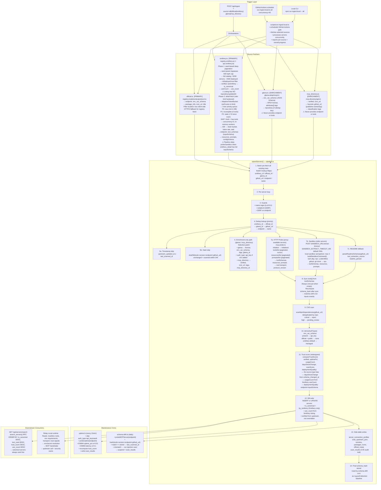

# Ingest Pipeline — Architecture Diagram

> Last updated: May 2026 — GitHub Actions scheduled ingest; local concurrent runner; no active Postgres ingest queue.

## Full Flow (Mermaid)



---

## Data Structures

Every upstream source normalizes into a single `IngestServer` contract before the pipeline runs.
Field grades indicate importance to `search_tools`, manifests, and future Relay Local `invoke_tool` reliability.

### `IngestServer`

| Field | Grade | Type | Notes |
|---|:---:|---|---|
| `name` | **A** | `string` | Slugified, `[a-z0-9-]+`. DB primary key. |
| `display_name` | **A** | `string` | Human-readable title. |
| `description` | **A** | `string` | Core search corpus. Never defaulted — README enriched if absent. |
| `transport` | **A** | `Transport` | `stdio \| sse \| streamable_http \| unknown` |
| `endpoint` | **A** | `string \| null` | Live HTTP URL. `null` for stdio — cannot be cloud-proxied. |
| `tool_schemas` | **A** | `ToolSchema[]` | Full schemas: name + description (search) + inputSchema (invoke). |
| `env_var_schema` | **A** | `EnvVarSpec[] \| null` | Credential requirements for vault injection. |
| `package_info` | **A** | `PackageInfo[] \| null` | Install specs. Official registry only. Needed for stdio invoke. |
| `tags` | **B** | `string[]` | Category tags. Glama `attributes[]` + mcp.directory classification. |
| `title` | **B** | `string \| null` | High-value for exact-name search. Official registry only. |
| `verified` | **B** | `boolean` | Trusted third-party vouched for this server. See definition below. |
| `github_url` | **B** | `string \| null` | Grade B for stdio (CLI install), Grade D for HTTP. |
| `resources` | **C** | `McpResource[]` | MCP Resources (paginated from probe/sandbox). |
| `prompts` | **C** | `McpPrompt[]` | MCP Prompts (paginated from probe/sandbox). |
| `long_description` | **C** | `string \| null` | Extended description from README or upstream. |
| `license` | **C** | `string \| null` | SPDX identifier. Glama only. `null` if undeclared — stored as `'unknown'` in DB. |
| `icon_url` | **D** | `string \| null` | Server logo. UI only. |
| `homepage_url` | **D** | `string \| null` | Documentation / product homepage. |
| `version` | **D** | `string \| null` | Semver. `null` for Smithery / Glama / mcp.directory (they don't version). |
| `readme_url` | **D** | `string \| null` | URL to the raw README file. |
| `use_count` | **F** | `number \| null` | Smithery `useCount`. Analytics + ranking tiebreaker only. Not a trust input. |
| `by_smithery` | **F** | `boolean` | Smithery built and hosts this server → sets `is_canonical = true` in DB. |

### `ToolSchema`

```ts
interface ToolSchema {
  name:         string;            // Must match [a-zA-Z0-9_-]+ per MCP spec
  description?: string;           // Grade A: search_tools intent matching
  inputSchema?: Record<string, unknown>; // Grade A: Relay Local invoke validation
}
```

### `EnvVarSpec`

```ts
interface EnvVarSpec {
  name:          string;
  description?:  string;
  isRequired:    boolean;   // true → user must supply before invoke
  isSecret:      boolean;   // true → vaulted (api_key auth_type)
  defaultValue?: string;
  format?:       'string' | 'number' | 'boolean' | 'filepath';
  placeholder?:  string;
  choices?:      string[];
}
```

> `deriveAuthType` fires `api_key` only when `isSecret || isRequired`. Optional config
> fields (neither flag set) do not block invocation.

### `PackageInfo`

```ts
interface PackageInfo {
  registryType:     string;   // npm | pypi | oci | nuget | mcpb
  registryBaseUrl?: string;
  identifier:       string;   // e.g. '@modelcontextprotocol/server-filesystem'
  version?:         string;
  runtimeHint?:     string;   // npx | uvx | docker | dnx
  fileSha256?:      string;
  transport:        Transport;
}
```

### `IngestResult` / `extraction_metrics`

```ts
interface IngestResult {
  added:    number;
  updated:  number;
  rejected: number;
  skipped:  number;
  errors:   string[];
  fetched?: number;
  extraction_metrics?: {
    smithery_detail_fetched:  number;  // Phase 2 detail API calls attempted
    smithery_detail_success:  number;  // Phase 2 calls that returned tool_schemas
    smithery_rate_limited:    number;  // 429s received from Smithery
    probe_attempts:           number;  // HTTP MCP probes fired
    probe_success:            number;  // Probes that returned ≥1 tool schema
    sandbox_attempts:         number;  // Sandbox extraction attempts
    sandbox_success:          number;  // Sandbox calls that returned ≥1 tool
    readme_fallback_attempts?: number; // README fallback after probe/sandbox returned 0 tools
    readme_fallback_success?:  number; // README fallback that extracted ≥1 tool
    grade_a_complete:         number;  // Servers with all Grade-A fields populated
    grade_b_complete:         number;  // Servers with all Grade-A + Grade-B populated
  };
}
```

### `ToolExtractionSource` (quality ladder)

| Value | Meaning |
|---|---|
| `smithery_detail` | Full inputSchema from Smithery `GET /servers/{id}` |
| `mcp_probe` | Live MCP handshake to a running HTTP/SSE endpoint |
| `sandbox` | Sandboxed local execution of a stdio package |
| `upstream_schemas` | Schemas provided directly by the upstream API |
| `upstream_names` | Only tool names available (no inputSchema) |
| `readme_parsed` | Parsed from README markdown (low confidence, stdio fallback) |
| `none` | No tool data from any source |

---

## Source → DB Field Coverage

| Field | official | smithery | glama | mcp_directory | probe | sandbox |
|---|:---:|:---:|:---:|:---:|:---:|:---:|
| `endpoint` | ✅ remotes[] | ✅ deploymentUrl | ❌ | ❌ | — | — |
| `transport` | ✅ | ✅ connections[] | inferred | ✅ transportType | ✅ | ✅ |
| `tool_schemas` | ❌ | ✅ **only** | ❌ | ❌ | ✅ | ✅ |
| `env_var_schema` | ✅ envVars[] | ✅ configSchema | ✅ **richest** | ❌ | ❌ | ❌ |
| `package_info` | ✅ **only** | ❌ | ❌ | ❌ | ❌ | ❌ |
| `icon_url` | ✅ icons[] | ✅ iconUrl | ❌ | ✅ avatarUrl | ❌ | ❌ |
| `github_url` | ✅ | ❌ | ✅ repo.url | heuristic | ❌ | ❌ |
| `license` | ❌ | ❌ | ✅ SPDX | ❌ | ❌ | ❌ |
| `tags` | ❌ | ❌ | ✅ attributes[] | ✅ classification | ❌ | ❌ |
| `verified` | ❌ (open registry) | ✅ top-level bool | ❌ | ✅ publisher | ❌ | ❌ |
| `is_canonical` | ❌ | ✅ bySmithery | ❌ | ❌ | ❌ | ❌ |
| `use_count` | ❌ | ✅ useCount | ❌ | ❌ | ❌ | ❌ |
| `auth_type` | derived | derived | patch | ❌ | ❌ | ❌ |
| `resources[]` | ❌ | ✅ | ❌ | ❌ | ✅ paginated | ✅ |
| `prompts[]` | ❌ | ✅ | ❌ | ❌ | ✅ paginated | ✅ |

---

## `verified` Field Definition

`verified = true` means: **a trusted external party has explicitly vouched for this server**.

| Source | How set | Meaning |
|---|---|---|
| **Smithery** | `s.verified === true` (top-level API field) | Smithery's own review process passed |
| **Smithery (bySmithery)** | Always `true` when `bySmithery === true` | Smithery itself built it |
| **official** | Always `false` at ingest | Open registry, namespace auth ≠ quality review |
| **mcp.directory** | Enrichment only: `publisher.verified` | mcp.directory curator trust signal |

> `verified` is NOT "this server exists in the official registry." The official MCP registry is open-submission — any developer can publish. `status: 'active'` only means the entry hasn't been moderated out.

---

## `is_canonical` Field Definition

`is_canonical = true` means: **this is the authoritative, Smithery-managed integration for this domain**.

Set only when `bySmithery === true` from the Smithery listing API. These are servers like Gmail, GitHub, Google Sheets, Exa — built and maintained by Smithery as first-class integrations.

**Effect on search ranking:** `ORDER BY is_canonical DESC` is the first sort key in `search_servers()`. When a user's intent matches "use GitHub to do X", the Smithery-managed GitHub integration always appears before community GitHub scrapers.

---

## Trust Score — Redesigned (migration 031)

| Signal | Points | Source of data |
|---|---|---|
| Security scan | 25 | CVE + static scan (`scanScore`) |
| Uptime | 20 | 15-min cron (`uptime_pct`) |
| Publisher credibility | 15 | `verified` field |
| Real-world usage | 15 | `use_count` (Smithery) — log scale |
| Deployment quality | 15 | Has `endpoint` + `tool_schemas` with `inputSchema` |
| Schema stability | 10 | Days since `schema_changed_at` (not hardcoded) |
| **Runtime penalties** | -15/-10 | failureRate / DLP |

> **Key change from previous design:** No source-type bias. `stars` and `daysSinceChange` are no longer hardcoded by source. All inputs are real measured data. `verified` weight reduced from 40 → 15 pts so unverified high-quality servers can still score well.

---

## auth_type Derivation Logic

```
deriveAuthType(source, transport, env_var_schema):
  any(isSecret) or any(isRequired)      → 'api_key'
  source='official'                     → 'none'
  source='smithery'                     → 'managed'
  default                               → 'managed'

Enrichment patch (Glama adds env_var_schema):
  → Re-runs deriveAuthType for requirement-aware classification.
```

---

## Naming Conventions

| Concept | DB `source` | File | Fetcher | API param |
|---|---|---|---|---|
| Open MCP Registry | `official` | `official.ts` | `fetchOfficialServers` | `official` |
| Smithery | `smithery` | `smithery.ts` | `fetchSmitheryServers` | `smithery` |
| Glama | `glama` | `glama.ts` | `fetchGlamaServers` | `glama` |
| mcp.directory | `mcp_directory` | `mcp_directory.ts` | `fetchMcpDirectoryServers` | `mcp_directory` |
| Self-submitted | `direct` | (API only) | — | — |

> `partner.ts` and `vendor.ts` have been decommissioned. The `github.com/mcp` org does not exist. The concept of canonical/authoritative servers is now encoded as `is_canonical` in the DB, derived from Smithery's `bySmithery` field.

---

## "Safe to go" Checklist

- [x] All 10 integration faults fixed
- [x] partner/vendor fully decommissioned (tombstoned, pending delete)
- [x] is_canonical column added (migration 031)
- [x] use_count column added (migration 031)
- [x] verified correctly read from Smithery top-level field (not security.scanPassed)
- [x] bySmithery captured and used to set is_canonical
- [x] Trust score redesigned — no source-type bias, real signals only
- [x] search_servers() ORDER BY is_canonical DESC
- [x] partner rows migrated to direct in DB (migration 031)
- [x] source_check constraint updated (partner in legacy block only)
- [x] global_stats() updated (partner removed, canonical_servers added)
- [x] API enum clean (partner removed)
- [x] mcp/route.ts corrected (no Anthropic attribution, no hallucinated sources)
- [x] schema_hash computed post-probe (matches drift cron)
- [x] tools[] always synced from probe/sandbox result
- [x] auth_type updated in enrichment patch path
- [x] env_var_schema + package_info in search response
- [x] api_key servers exempt from uptime probe
- [x] mcp_directory heuristic github_url for dedup
- [x] extraction_metrics aligned pipeline ↔ response builder
- [x] ToolExtractionSource type has 'readme_parsed'
- [x] Sandbox fetch has 60s AbortSignal timeout
- [x] Subprocess SIGTERM + SIGKILL cleanup in sandbox
- [x] resources/prompts paginated in mcp-probe.ts
