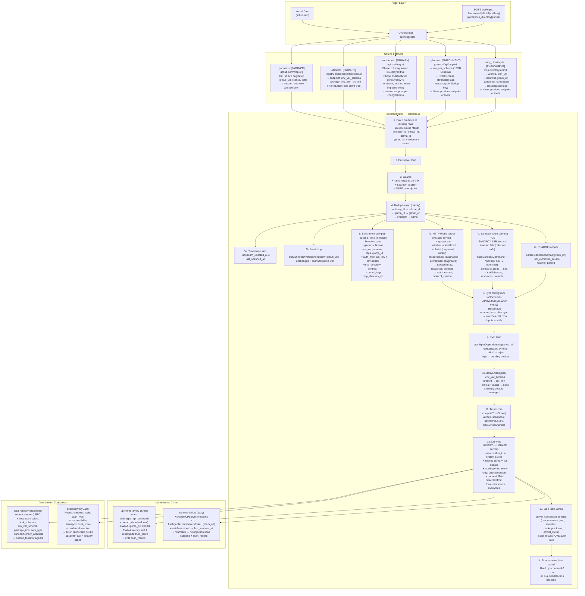

# Ingest Pipeline — Architecture Diagram

> Last updated: May 2026 — reflects all v2 hardening + deep integration audit fixes.

## Full Flow (Mermaid)



---

## Source → DB Field Coverage

| Field | partner | official | smithery | glama | mcp_directory | probe | sandbox |
|---|:---:|:---:|:---:|:---:|:---:|:---:|:---:|
| `endpoint` | ❌ | ✅ remotes[] | ✅ deploymentUrl | ❌ | ❌ | — | — |
| `transport` | probed | ✅ | ✅ connections[] | inferred | ✅ transportType | ✅ | ✅ |
| `tool_schemas` | ❌ | ❌ | ✅ **only** | ❌ | ❌ | ✅ | ✅ |
| `env_var_schema` | ❌ | ✅ envVars[] | ✅ configSchema | ✅ **richest** | ❌ | ❌ | ❌ |
| `package_info` | ❌ | ✅ **only** | ❌ | ❌ | ❌ | ❌ | ❌ |
| `icon_url` | ❌ | ✅ icons[] | ✅ iconUrl | ❌ | ✅ avatarUrl | ❌ | ❌ |
| `github_url` | ✅ html_url | ✅ | ❌ | ✅ repo.url | heuristic | ❌ | ❌ |
| `license` | ✅ | ❌ | ❌ | ✅ SPDX | ❌ | ❌ | ❌ |
| `tags` | ❌ | ❌ | ❌ | ✅ attributes[] | ✅ classification | ❌ | ❌ |
| `verified` | ✅ always | ✅ | ✅ | ❌ | ✅ publisher | ❌ | ❌ |
| `auth_type` | derived | derived | derived | patch | ❌ | ❌ | ❌ |
| `resources[]` | ❌ | ❌ | ✅ | ❌ | ❌ | ✅ paginated | ✅ |
| `prompts[]` | ❌ | ❌ | ✅ | ❌ | ❌ | ✅ paginated | ✅ |

---

## auth_type Derivation Logic

```
deriveAuthType(source, transport, env_var_schema):
  env_var_schema present and non-empty  → 'api_key'
  source='official' and transport=HTTP  → 'none'   (public MCP registry)
  source='smithery'                     → 'managed' (Smithery-managed auth)
  default                               → 'managed'

Enrichment patch (Glama adds env_var_schema to existing record):
  → also writes auth_type = 'api_key'   ← FAULT-01 fix
```

---

## Naming Conventions

| Concept | DB `source` | File | Fetcher | API param |
|---|---|---|---|---|
| github.com/mcp org | `partner` | `partner.ts` | `fetchPartnerServers` | `partner` |
| Official MCP registry | `official` | `official.ts` | `fetchOfficialServers` | `official` |
| Smithery | `smithery` | `smithery.ts` | `fetchSmitheryServers` | `smithery` |
| Glama | `glama` | `glama.ts` | `fetchGlamaServers` | `glama` |
| mcp.directory | `mcp_directory` | `mcp_directory.ts` | `fetchMcpDirectoryServers` | `mcp_directory` |

> `vendor.ts` is a deprecated re-export shim → `partner.ts`. Will be removed in a future cleanup.

---

## "Safe to go" Checklist

- [x] All 10 integration faults fixed
- [x] vendor→partner rename complete, shim in place
- [x] API enum clean (`'github'` removed, `'vendor'` removed, `'mcp_directory'` added)
- [x] schema_hash computed post-probe (matches drift cron)
- [x] tools[] always synced from probe/sandbox result
- [x] auth_type updated in enrichment patch path
- [x] env_var_schema + package_info in search response
- [x] api_key servers exempt from uptime probe
- [x] partner.ts transport defaults to 'unknown'
- [x] mcp_directory heuristic github_url for dedup
- [x] extraction_metrics aligned pipeline ↔ response builder
- [x] ToolExtractionSource type has 'readme_parsed'
- [x] Sandbox fetch has 60s AbortSignal timeout
- [x] Subprocess SIGTERM + SIGKILL cleanup in sandbox
- [x] resources/prompts paginated in mcp-probe.ts
